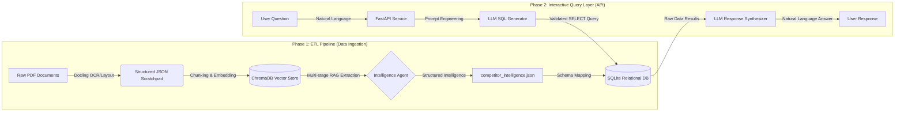

# Competitor Intelligence Agent

A multi-stage intelligence pipeline designed to extract, structure, and query competitive data from unstructured game documents (PDFs). The system transforms raw documentation into a searchable relational database and provides a natural language interface for complex analytical queries.

## System Architecture

The project implements a decoupled, event-driven architecture organized into two primary phases: the **ETL Pipeline** and the **Interactive Query Layer**.

### Architecture Overview



### Detailed Component Breakdown

#### 1. Document Transformation (`document_converter.py`)
Utilizes the **Docling** framework to process PDF documents. This component performs:
- **OCR & Layout Analysis**: Extracting text while preserving document structure.
- **Table Extraction**: Converting complex document tables into structured markdown for better LLM context.
- **Image Metadata**: Capturing visual elements for potential multimodal analysis.

#### 2. Vectorization & Retrieval (`vector_store.py`)
Processed documents are chunked and stored in **ChromaDB**. 
- **Embeddings**: Employs `BAAI/bge-large-en-v1.5` for high-dimensional text representation.
- **Reranking**: Uses `Jina Reranker v2` (multilingual) in a dual-stage retrieval process to refine context relevance before LLM analysis.

#### 3. Intelligence Extraction Agent (`agent.py`)
A specialized agent powered by **Llama-4-Scout (17B)** that operates in three distinct stages:
- **Discovery**: Scans the vector space to identify unique competitor names and entities.
- **Attribute Analysis**: For each identified competitor, the agent performs targeted retrieval to find gameplay features, pricing, strengths, and weaknesses.
- **Synthesis**: Merges disparate research findings into a normalized JSON schema.

#### 4. Relational Normalization (`init_db.py`)
The unstructured extraction results are mapped to a normalized SQL schema. This allows for precise analytical queries (e.g., "Compare the pricing of all RPG games") that are often difficult for standard RAG systems to execute with consistent structural integrity.

#### 5. Secure Q&A API (`api.py`)
A **FastAPI** interface that translates natural language to SQL.
- **SQL Translation**: Llama-4 generates ANSI SQL based on the database schema.
- **Security Validation**: The system enforces a strict **read-only** execution environment. Queries are validated to ensure only `SELECT` statements are executed, with a blacklist for destructive keywords (e.g., `DROP`, `DELETE`).
- **Response Synthesis**: Query results are converted back into concise natural language summaries.

## Technology Stack

| Layer | Technology |
| :--- | :--- |
| **LLM Inference** | Groq (Llama-4-Scout-17B) |
| **Document Processing** | Docling (IBM) |
| **Vector Database** | ChromaDB |
| **Relational Database** | SQLite |
| **Orchestration** | LangChain |
| **API Framework** | FastAPI + Uvicorn |
| **Embeddings/Reranking** | Hugging Face (BGE) & Jina AI |
| **Containerization** | Docker & Docker Compose |

## Getting Started

### Prerequisites
- Docker and Docker Compose
- API Keys for: **Groq**, **Hugging Face**, and **Jina AI**

### Installation
1. Clone the repository.
2. Create a `.env` file based on `.env.example`:
   ```env
   GROQ_API_KEY=your_key
   HUGGINGFACEHUB_API_TOKEN=your_key
   JINA_API_KEY=your_key
   ```
3. Place your raw PDF documents in the `./dataset` directory.

### Running the Pipeline
The system is orchestrated via Docker Compose. Run all services sequentially:

```bash
docker-compose up
```

This will automatically trigger:
1. `docling-converter`: PDF to JSON transformation.
2. `vector-store`: Ingestion into ChromaDB.
3. `agent`: Intelligence extraction.
4. `init_db`: SQLite population.
5. `api`: Starts the web server on `http://localhost:8000`.

## API Usage

### Example Query
**Endpoint**: `POST /query`  

**Request Payload**:
```json
{
  "question": "What are the games from competitors"
}
```

**Example Response**:
```json
{
  "question": "What are the games from competitors",
  "sql_query": "SELECT name FROM Competitors;",
  "sql_result": "[('Call of Duty: Mobile',), ('Dream Games',), ('Honor of Kings',), ('Roblox',), ('MONOPOLY GO!',), ('Mobile Legends: Bang Bang',)]",
  "answer": "The identified competitor games (and developers) include Call of Duty: Mobile, Dream Games, Honor of Kings, Roblox, MONOPOLY GO!, and Mobile Legends: Bang Bang."
}
```

### Security Measures
- **Read-Only Access**: The SQLite connection string utilizes `mode=ro` to prevent write operations.
- **Query Validation**: All generated SQL is parsed to ensure it begins with `SELECT`.
- **Keyword Blacklisting**: Queries containing destructive keywords (e.g., `DROP`, `DELETE`, `UPDATE`) are rejected before execution.


## Limitations

- **API Rate Limits**: Subject to free-tier quotas for Groq, Hugging Face, and Jina AI; high-frequency requests may trigger rate limiting.
- **Model Performance**: Open-source models like Llama-4-Scout may have smaller context windows and higher analytical variance compared to larger proprietary models.
- **Hardware**: Docling requires an **NVIDIA GPU** for acceptable performance; CPU-only execution is significantly slower.
- **Source Quality**: Extraction accuracy is dependent on document layout quality and scan clarity.
- **Static Schema**: The relational database uses a fixed schema; adding new intelligence categories requires code and prompt modifications.
